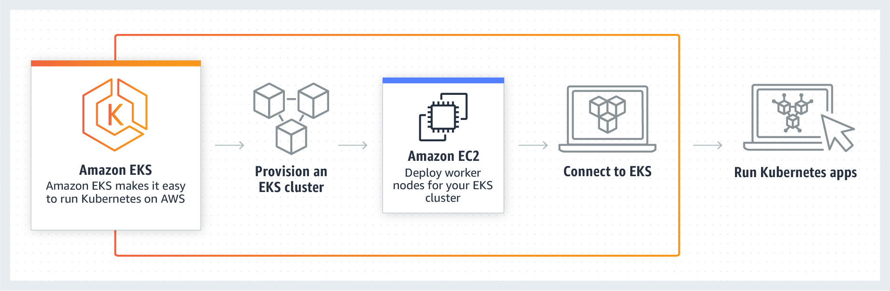
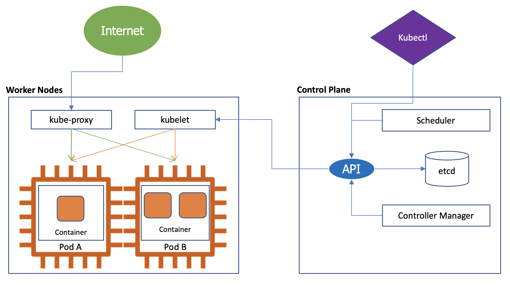

# Chapter 2: An Introduction to Kubernetes

Kubenetes Walkthrough

This chapter will introduce you to the basic workings of Kubernetes, This is mandatory if you are new to Kubernetes

### We will walk you through the below important topics

- Kubernetes (k8s) Basics
- Kubernetes Architecture
- Amazon EKS

## Content

You may click on the below chapters to jump on that

- [Workshop Introduction](https://github.com/CloudStrategyOfficial/workshop-aws-eks-terraform/blob/main/workshop_introduction.md)
- [An Introduction To Kubernetes](https://github.com/CloudStrategyOfficial/workshop-aws-eks-terraform/blob/main/An_introduction_to_Kubernetes.md)
- [Setting up The Workshop Environment](https://github.com/CloudStrategyOfficial/workshop-aws-eks-terraform/blob/main/Setting_up_the_Workshop_environment.md)
- [A Terraform Introduction & Primer for those unfamiliar with Terraform](https://github.com/CloudStrategyOfficial/workshop-aws-eks-terraform/blob/main/_primer_for_those_unfamiliar_with_Terraform.md)
- [Building a private EKS cluster with Terraform](https://github.com/CloudStrategyOfficial/workshop-aws-eks-terraform/blob/main/Building_a_private_EKS_cluster_with_Terraform.md)
- [Extra optional activities](https://github.com/CloudStrategyOfficial/workshop-aws-eks-terraform/blob/main/Extra_optional_activities/md)
- [Conclusion](https://github.com/CloudStrategyOfficial/workshop-aws-eks-terraform/blob/main/Conclusion.md)
- [Cleanup](https://github.com/CloudStrategyOfficial/workshop-aws-eks-terraform/blob/main/Cleanup.md)

## Kubernetes Basics

### What is Kubernetes

- Open source container management platform
- Helps you to run your container at scale
- Provides Objects and APIs for building modern applications

### Kubernetes Nodes

- Machines (Servers) utilizes kubernetes cluster, called Nodes
- Nodes in a Kubernetes cluster may be physical, or virtual.

#### There are two types of nodes:

- A Control-plane-node type, which makes up the Control Plane, acts as the “brains” of the cluster.
- A Worker-node type, which makes up the Data Plane, runs the actual container images (via pods).

### K8s Objects Overview

- Kubernetes objects are entities that are used to represent the state of the cluster.
- Object: “record of intent” – once created, the cluster does its best to ensure it exists as defined. This is known as the cluster’s “desired state.”
- Kubernetes is always working to make an object’s “current state” equal to the object’s “desired state.” 

#### A desired state can describe:

- What pods (containers) are running, and on which nodes
- IP endpoints that map to a logical group of containers
- How many replicas of a container are running
And much more…

### K8s Objects Detail

#### Pod
- Smallest unit that is managed by Kubernetes, it runs one or more containers inside it

#### DaemonSet
- Implements a single instance of a pod on a worker node

#### Deployment
- Details how to roll out (or roll back) across versions of your application
- You describe a desired state in a Deployment, and the Deployment Controller changes the actual state to the desired state at a controlled rate
- You can define Deployments to create new ReplicaSets, or to remove existing Deployments and adopt all their resources with new Deployments

#### Deployment Use Case

The following are typical use cases for Deployments:

- Create a Deployment to rollout a ReplicaSet. The ReplicaSet creates Pods in the background.
- Declare the new state of the Pods by updating the **PodTemplateSpec** of the Deployment. A new ReplicaSet is created and the Deployment manages moving the Pods from the old ReplicaSet to the new one at a controlled rate. Each new ReplicaSet updates the revision of the Deployment.
- Rollback to an earlier Deployment revision if the current state of the Deployment is not stable. Each rollback updates the revision of the Deployment.
- Scale up the Deployment to facilitate more load.
- Pause the rollout of a Deployment to apply multiple fixes to its PodTemplateSpec and then resume it to start a new rollout.
- Use the status of the Deployment as an indicator that a rollout has stuck.
- Clean up older ReplicaSets that you don't need anymore.

#### ReplicaSet
- Ensures a defined number of pods are always running

#### Job
- Ensures a pod properly runs to completion

#### Service
- Maps a fixed IP address to a logical group of pods

#### Label
- Key/Value pairs used for association and filtering (Like Tags)

## Kubernetes Architecture

### Control Plane

- API Server: Entry point for REST / kubectl
- etcd: Distributed key/value store (Like Tags)
- Controller-manager: Always evaluates current vs desired state
- Scheduler: Schedules pods to worker nodes

### Data Plane

- Made up of worker nodes
- kubelet: Acts as a channel between the API server and the node
- kube-proxy: Manages IP translation and routing

#### Reference

- [AWS Workshop](https://tf-eks-workshop.workshop.aws/000_workshop_introduction.html)
- [Official Kubernetes Document](https://kubernetes.io/docs/concepts/overview/what-is-kubernetes/)