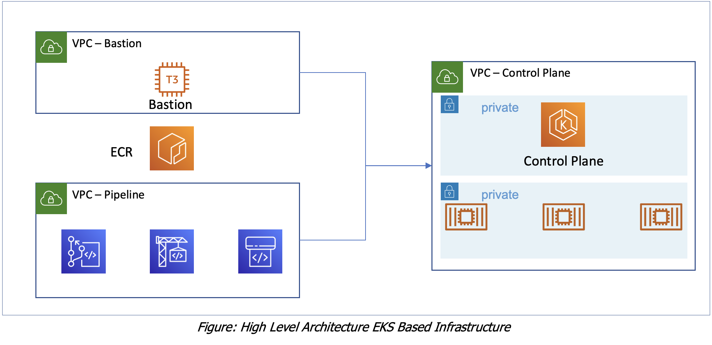

# High Level Architecture

## Please select the Chapters Below

## Chapters

You may click on the below chapters to jump on that

- [Workshop Introduction](https://github.com/CloudStrategyOfficial/workshop-aws-eks-terraform/blob/main/workshop_introduction.md)
- [An Introduction To Kubernetes](https://github.com/CloudStrategyOfficial/workshop-aws-eks-terraform/blob/main/An_introduction_to_Kubernetes.md)
- [Setting up The Workshop Environment](https://github.com/CloudStrategyOfficial/workshop-aws-eks-terraform/blob/main/Setting_up_the_Workshop_environment.md)
- [A Terraform Introduction & Primer for those unfamiliar with Terraform](https://github.com/CloudStrategyOfficial/workshop-aws-eks-terraform/blob/main/_primer_for_those_unfamiliar_with_Terraform.md)
- [Building a private EKS cluster with Terraform](https://github.com/CloudStrategyOfficial/workshop-aws-eks-terraform/blob/main/Building_a_private_EKS_cluster_with_Terraform.md)
- [Extra optional activities](https://github.com/CloudStrategyOfficial/workshop-aws-eks-terraform/blob/main/Extra_optional_activities/md)
- [Conclusion](https://github.com/CloudStrategyOfficial/workshop-aws-eks-terraform/blob/main/Conclusion.md)
- [Cleanup](https://github.com/CloudStrategyOfficial/workshop-aws-eks-terraform/blob/main/Cleanup.md)

